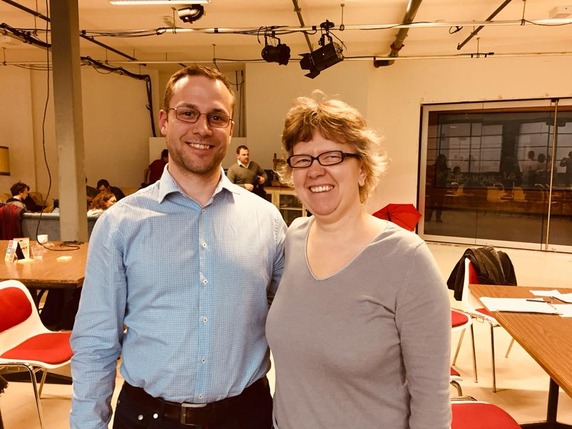

Last weekend I participated at the Open Food Hackdays in Basel. As on any hackathon
I have joined so far, it meant a lot of fun, new acquaintances and most of all, fast-track learning. 
This time, I learned some valuable lessons on machine learning.

I joined the team _prognolite_, which has already been existing as a startup and was
already very successful at the previous Open Food Hackdays in Lausanne. Enriched with
a few data scientists, a UX specialist and me in the role of frontend dev, we hacked away for
36 hours. The goal was a mobile app that helps restaurants forecast the number of customers for the
next few days, based on historical data of the same restaurant. This ultimately lead to a functional
app prototype called _Antonios Kitchen Solution_.

While I already have been peeking into data science, this project was really 
a revelation to me. Mostly because of the tangible, practical way we employed machine learning,
in a much more focused scope than big data or business intelligence. That was new to me.
Not just doing a one-off analysis, but something _repeatable, well encapsuled_. 
This is music to a developer'sears. Data scientists create (or rather _train_) ML models, 
and we make them available as services, just like a library.

> Machine learning is not just about big data or business intelligence. It can be
> employed at a very practical level, e.g as microservices being consumed by traditional
> transactional applications.

This impression of ML being _here and now_, and way past its 'academic' phase has 
been energizing me since the Hackdays, and this article ist just the preface to a 
series of blog articles to come (and hopefully something on GitHub as well).

Just as a hint on what might come: Serving Scikit-Learn ML models as a REST API 
with a Flask server seems to be fairly straightforward (and without dependencies to cloud
providers). We already implemented this architecture approach in part during the hack, but
abandoned it in favor of an API that was already in place.

Thanks to the whole team and the OpenData guys for the amazing experience, 
thanks to Jutta for being in the photo below with me, 
and to my employer **[IWF Web Solutions](https://www.iwf.ch/web-solutions)** for letting
me go to the hackdays partly during working time!

Photo: Jutta Jerlich from BaselHack and me

## Links
* [Website of the Open Food Hackdays](https://food.opendata.ch/#hackdays)
* [Prognolite Website](https://prognolite.com/site/en/#)
* [Github Repo of the Hackdays](https://github.com/bar9/prognolite)