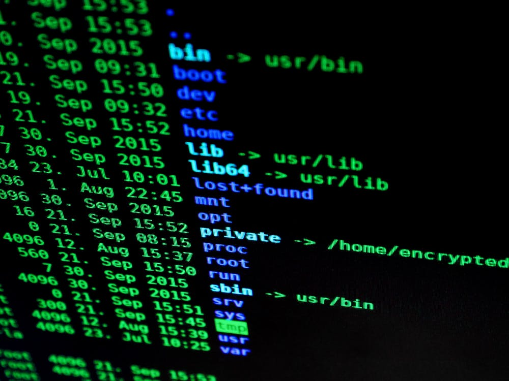

A lot of people are taking up programming nowadays, either because they're young and it's
one of the options for them to take up, or because of the opportunities in a vastly growing
sector. Programming beginners are confronted with the difficult choice of their first language. 

> Any energy is wasted partaking in a 'camp'

Before all else, don't listen to the camps of a 'superior' language and to flame wars
based on _fancier features_ or even worse, because of something being considered
_not cool anymore_ (as in _who still uses jQuery, for real?_). 
It just does not matter that much.
There are more important things to focus on.
Here's a list of things you will need to learn regardless of language.
They all are not coupled to any language, so they could even be learned before learning to program.
In 10 to 20 years, when all the cool languages of today are history, many of the points below
will still be relevant and not have changed so much. So it's well worth learning those.

## Version control
Version control allows projects to stretch over time and many people and teams to collaborate
_without_ people overwriting stuff of the others or not being able to find old work. __git__ is
an unquestioned standard in that respect. Learning __git__ is a top priority for anyone new
to programming. It takes some time and will accompany you every day.

Really, __make learning git a top priority__!

## Versioning
Sooner or later you will depend on other people's code and use libraries, packages, modules,
plugins (or whatever they are called in your language) for your work. You most likely will 
experience _dependency hell_ at one point. To make things a little bit more transparent for you,
you might want to learn the principles of __semantic versioning__. 
This can be checked off quickly, it's an easy but valuable concept.

## Encodings
Even though we have almost half a century of high level languages behind us, some things we struggle
with are still very arcane. One of these things is _character encodings_. The importance of this one
 depends on 
your orientation. As an aspiring frontend developer it will not often bother you. In the backend
however, when you work with databases, data migrations or message passing, you need to always be
aware of the encoding of the data at any point of your pipeline. Ignorance will be painful there.

You should at least look up _UTF-8_ and _ASCII_ and read up on what your language uses internally.
When you get to be more advanced, try finding out about different string formats in your language
(e.g. byte streams vs. character arrays). Results may vary.

## Float arithmetic and integer overflow
Computers do arithmetic in binary, and any language calls the interfaces the CPU provides for
that. Most of the time you are just fine with that, and what you learned in your math classes
holds true. However you need to be aware that in order to perform e.g. an addition,
the two summands are filled into a register of (usually) 64bit length before the operation. 
The result must fit within those 64bit as well. If a calculation results in a value longer than 
the register, the surplus is just truncated. This leads to undefined results for 
e.g. adding or multiplying very large integers or very small errors on float operations, for instance
`0.2 + 0.1` is not exactly `0.3`.
Beware that you cannot always count on mathematical truths as you know them being implemented 
perfectly. For almost any language, there are (built-in or contributed) libraries for _arbitrary
precision math_. Get acquainted with them and use them if appropriate.

## Sockets
As soon as you're getting started with your "hello world", To-Do lists or other demo apps, you
are likely to encounter someting such as `127.0.0.1:8888 ` to open in your browser. 
That's the address of a socket, consisting of the host (127.0.0.1 is your computer, often aliased by
`localhost`), and the port (`8888` in our example). 
You can use sockets for bidirectional communication between programs or processes.
Even if your language provides easy to use helper functions, they are always managed by your
operating system (or computers in a network). So if you can't use a socket it might be blocked
by a firewall or wrongly configured DNS.

## Environment Variables
Mac, Windows and Linux have more in common than you might be aware of. One of these things are
environment variables. Those are often, but not exclusively, used to store paths on the
 filesystem. For instance, all major operating systems have the concept of a
`TEMP` directory. Because the path to the directory is not the same for each OS (or think custom
installations), the path is stored in an environment variable. The variable _can be looked up
anytime from within any program/process_ and your language of choice will have helper functions
to do so.

## Stdin/Stdout/Stderr, args
Console tools are hip again, and that is for a reason. You can script and automate complex
workflows relatively easily, and even more importantly, you can chain together completely
unrelated tools. The standard I/O streams (`Stdin/Stdout/Stderr`) 
behave roughly the same on Windows, Linux and Mac,
and represent the interface for chaining together tools. `Args` are command arguments, allowing
to configure the command. Your language will have helper functions to read from and write to the
I/O streams and read arguments. Once you grasp them, you have a very simple yet sustainable
user interface at your disposal, allowing to share your programs with others or make it interact
with other programs easily.

## Build time vs. runtime
Basically we distinguish between compiled languages and interpreted languages. There are nuances
in between, such as Just in Time compilation. However for practical purposes, 
this distinction can be misleading, depending on your point of entry. If you use a powerful
framework for an interpreted language for instance, you might still need to _compile_ (or build).
It is important to develop a rough understanding for what happens during the build, and how this
transforms your code (especially types). Some things have different meanings at build time or 
runtime, one trivial example is the family of `now()` functions. Do we want to capture 
'build time time' or output 'runtime time'?

## Data Structures
Your language might have classes and objects, lists, arrays, functions, and it's perfectly fine
to use the structures it is best at for most of the work, e.g. classes in Java. But you
might at that point not expect that many useful structures could be missing. Maybe you want to 
port an algorithm from another language and are missing a certain feature. 
That's no big issue, you can (almost) always add your own structures, or better, 
import them from a library. Never switch language e.g. because it doesn't support 
complex numbers natively. If you don't use a structure extensively, you can always add your own
structures. It never hurts to know some widespread structures and their _conceptual_ meaning,
such as __lists__, __maps__, __sets__, __trees__, __matrices__, and how your language supports them.

## Domain modelling
In 2018 developers still have to put considerable work into the translation of domain
logic (e.g. features we want to build, real world entities we reason about) 
into their programming language. 
Object oriented programming has helped a bit (you can map real world objects to
class __objects__ on your computer, but we still struggle with the overarching structures around 
those objects). 

Domain modelling is a most essential skill for successful software development.
Basically you need to look at reality (or the dream you want to bring to life)
and try expressing
it with as few and simple building blocks as possible, while still being coherent and complete. 
The building blocks should represent elements of the programming language at your disposal.
This task is _hard_, and should be exercised often. Attention to detail and asking questions
are key, because virtually any specification, idea or theoretical model has conceptual gaps,
and computers are unforgiving with those. 
