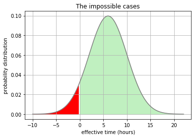

Doesn't it bug you that you always estimate development time lower than the time you actually spend
on development? And you never seem to learn? Many try to find the answer in psychology, this may hold
some truth, but a large portion of this bias can easily be explained mathematically. The problem is, that
we foolishly assume normal distributions, where they simply cannot be.

## The wrong assumption

Let's start with a simple example. We have a rough idea that our task is going to take __6 hours__ to
develop (e.g. a non-trivial UI component along with backend endpoint calls and some styling). Because
software development is software development, we take into account the possibility of a high deviation from
this mean, say __+/- 4 hours__. We assume that we are confident with our estimated mean and that in sum,
overestimated and underestimated tasks will cancel each other out. And that's where our intuition is 
terribly wrong!

If we assume a __+/-__ to be reasonable the same amount to both sides of the estimate, we implicitly assume
a normal distribution (with mean 6) as shown in the following graphic:

However, all time durations below zero cannot exist by definition. You cannot win time with a task, you
can just spend more or less of it.

> Deviation from an _average_ estimate can never be normally distributed because it cannot go below zero.
> That's why in aggregate, our estimates are systematically wrong _to the left_.

Hence, to correct our assumption to a more realistic (probably still wrong) distribution, we cancel out
the red area below:

But with this cut, our estimated mean is not the expected mean of the distribution anymore. Basically
we have to shift it to the right as far as it can fit the red surface between its old and new position.
This corresponds to the integral under the probability density function.

You can see the correction in orange color below:

So by how much is our 6 (+/- 4) hours estimation off? In that case, __13.5% off. Systematically.__

## How does this correspond to reality?

So far we have stayed rather theoretical. But the bias pointed out above does correspond to the real world.
Let's think a bit more about our +/- 4 hours. We know this is a reasonable range because with experience, we
have learned that at least 2 in 3 times we have developed similar things in the past, we have been within
this range. So far, normal distribution applies, we are within the standard deviation and the 66%
percentile. And we never go below zero.
But we have forgotten the __long tail__, far to the right of the distribution. 
> The long tail is the one time we spent 18 hours on such a task,
> because requirements changed the minute before completion. That's not a frequent
> case, and we tend to think we can ignore it. 

But that would be fatal: Our assumption that the pluses and minuses
cancel each other out cannot work anymore. Because we cannot cancel `6 + 11` out to the left,
only `6 - 6` is remotely possible. We would need to overcompensate and complete two tasks estimated at
six hours in 30 minutes each!
The __long tail__ is responsible for moving only a few tasks to the right on the time axis, but far 
to the right. And that is why even seasoned developers tend to estimate too low in aggregate. They can
well be 10% off or more, the higher the variance. 

## More on this?
The example calculations and graphics were developed in a _Jupyter Notebook_, more on them will follow in
my _Machine learning article series_ soon to come. You can check out the notebook 
[here](https://github.com/bar9/estimates) on GitHub.

If you would like to see more on this topic or would like to see the current notebook evolve into 
an interactive tool to calculate long tail bias, please feel free to star the repo or share/like 
this article on social media.
