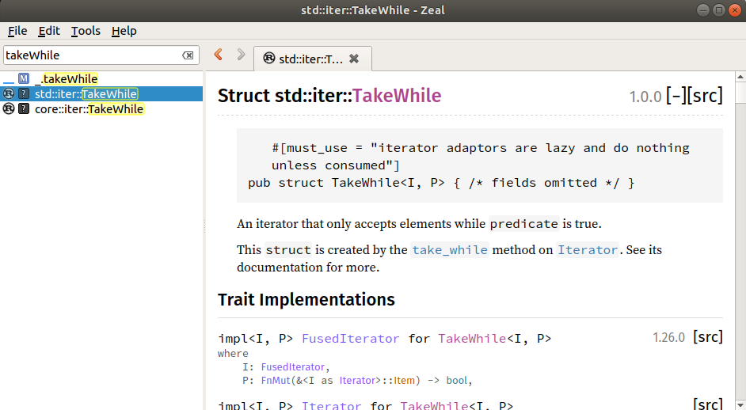

Software engineering is getting easier and harder at the same time. New tools and abstractions provide tremendous power, 
while increasing quality standards and wider scope for software make this power a necessity. The term __full stack__ is rather new, and still the size of the average stack seems to keep increasing. The days of __'the' documentation__ have long gone. This is why I instantly fell in love with zeal.

## Taking a Stroll
We tend to underestimate the importance of leisure and aimless actions. By spontaneously and rather aimlessly browsing the Ubuntu software center, I seem to have fount a gem!
__Zeal__ is calling itself a 'simple offline documentation browser', and this description fits rather nicely. Zeal is an open source project by Oleg Shparber and other contributors and has been inpired by the Mac-only __Dash__. The screenshot below shows its basic functionality: searching documentation.

However, in this simplicity lies an enormous power to speed up the frequent task of looking up APIs.

## The full Stack
Maybe a decade to a few years ago, you were good with having a number of browser shortcuts for your __framework__ of choice. I am still doing that to some extent. With the shift from single frameworks to whole stacks and the advent of DevOps, this seems increasingly inadequate. A full stack developer needs fluency and tooling in the several layers of his stack, usually consisting of ~ 3 to 6 frameworks and toolchains. These layers usually span one or two general-purpose programming languages along with special-purpuse syntax such as SQL, CSS or templating languages.
Looking up functions, classes, etc. for the respective APIs on the respecitve websites is not as efficient as it could be, since they all have rather different structure. For the main framework, one can use the IDE to look up the abstractions of the framework one is using. IDEs in general have gone great lenghts to provide documentation __just in time__. However they still rarely provide usable API search facilities. As soon as projects grow larger and the IDE gets slowed down, framework directories are the first ones to get excluded from project-wide search indexes. 

Zeal provides search across all underlying stack APIs with blazing speed, and it is easily assigned to a keyboard shortcut to be an immediate entry point for all API searches, across all layers of your stack.
The contents of the docs are aggregated from the original documentation and seem to be easily updateable. 
The docsets available cover virtually any stack I've worked with, and a lot more I have never touched, yet they could be expanded by custom feeds, which would be a way to include your own documentation via the same entry point. Along with the numerous IDE extensions for Dash, this could provide a robust instrument for __DevDocs__ style documentation sharing, where a developer for instance can browse the documentation of a REST API in the same fashion as the framework.

## Outlook
Since I just stumbled across Zeal today, I have no long term experience with it. Nevertheless, I urge you to give it a try too if you're on Linux or Windows, or have a look at Dash if on a Mac. Let's break our annoying habits of reading outdated documentation found on Google Search or StackOverflow!

