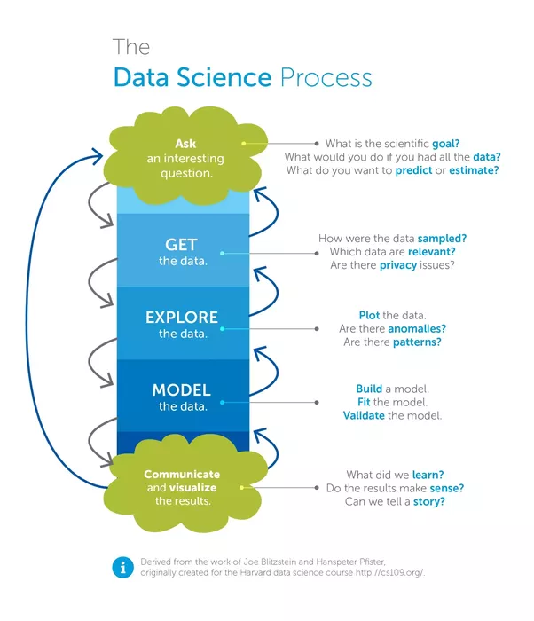

Not long ago machine learning used to be pretty "academic" in the sense that the only way to access the concepts
it was through formal mathematical notation. Machine Learning is probably the heartpiece of the still new
profession of __data scientist__, dubbed the _sexiest job of the 21st century_. So far, this sexiness has
become increasingly accessible to developers, including those without a PhD in statistics.

You might have rough idea what data science and machine learning are, 
and might have heard about __R__ and __Python__ with Scikit-Learn being popular languages for data science. 
If you are thinking about robots and artificial intelligence from the movies right now,
you might want to reframe your conception of machine learning. Current machine learning concepts and methods are down to 
earth and it's really more statistics than science fiction magic.

For instance, when looking at the data science process described below, Skynet probably wanders off our mind
but you might start thinking about Excel.

Machine learning tools can not do that process for you (and probably never will, since it's still hard to imagine
a computer asking an interesting question to start with). But they allow you to dump Excel and provide a hugely __simplified__ way of dealing with 
the __computationally heavy steps__ along the way. With an interactive ML tool that you control by a programming language,
data exploration and modelling can be pretty fun.
The tools allow you to try models that you do not understand internally, apply
them to your data and immediately test for success, so ML applications can point you to directions you might have been 
unaware of. And they can help you with solving problems approximately that are extremely hard or impossible to solve algorithmically.
ML is fun because it delegates repetitive, tedious detail work to the computer while you get to do the
interesting parts: asking the right questions and checking the work of the computer.

## Jupyter Notebooks
The medium __Jupyter Notebook__ is a breakthrough in documentation and distribution of data science work (and potentially
for a lot of other work on a computer). Jupyter notebooks (formerly iPython notebooks) are 
__interactive documents__ where you can easily intermix text and commands with the output of the commands.
Such a notebook runs in your browser and can be saved as an `.ipybn` file. 

This allows you to document complex workflows in a linear and repeatable fashion, an important step
towards reproducibility of scientific work. Since the notebook is backed by an interpreter kernel,
any step is repeatable and you can inspect any intermediary state, somehow like stepping through a debugger.

The kernel is interchangeable, so you are in no way limited to Python. There exist Jupyter kernels for
dozens of languages, as long as they are interpreted.

Graphical output, which is paramount for inspecting data, is rendered directly into the notebook. 
Notebooks can be viewed on Github without rebuilding the runtime locally.

These properties of Jupyter notebooks allow for a __data analysis__ to __evolve over time__ from a simple lab
notebook where data is loaded and explored, then to a model, and ultimately to a fully documented analysis
close to publishing quality.

And then, work can be easily shared with others. You just pass them the notebook file, allowing them
to step through your thinking process and exactly reproduce your model/analysis. As a bonus, those 
files can be viewed on GitHub without any further infrastructure (though they are not interactive there).
That signifies a very large step towards __reproducibility of research__.

## Kaggle Datasets and Challenges
While Jupyter notebooks answer the __HOW__ of accesible data science, __Kaggle__ has great contributions to 
the __WHY__ and __WHAT__.
Kaggle is a data science platform with some aspects of a social network, and a strong _gamification_ element in the 
form of challenges.
It is a great environment to learn: You can choose among an ever growing number of challenges along with 
corresponding datasets, explore and model directly on the platform (they provide a runtime) and easily feed back
your results, which are immediately compared with other people's results, so there is instant feedback.

Apart from beginner tutorials and more game-like challenges, Kaggle also provides a platform for customers to pose real
data science questions, which are then tackled by competitive kagglers and teams in order to win; the best solution wins money.

So Kaggle is a learning platform and a marketplace for data analysis, but it is also a __catalyst for best practices__: 
by constant comparison with others, convergence towards general data science workflow happens:
  * data gathering
  * data cleansing
  * train
  * test
  * predict
  
> From such an environment, uniform and simple interfaces (for algorithms and libraries) emerge; a recipe for success 
> that also worked for the world wide web.

## Consequences
As a conseqence of accessible tools such as Jupyter and Kaggle, a lot of people are trying their luck with data science, 
and a multitude of scripts are publicly available. Obviously not all of them are of quality, and just because
something looks impressive does not mean a lot. 
Still, ML models behave __more and more like software libraries__; developers can potentially use them, 
but for that we need to know how their interfaces work.

We __can__ integrate ML models to apps as of today, allowing for dissemination of research and for very practical business purposes.
In my next article on ML, we will look at serving a simple ML model as a REST api.

## Links
[A gallery of interesting Jupyter Notebooks](https://github.com/jupyter/jupyter/wiki/A-gallery-of-interesting-Jupyter-Notebooks)