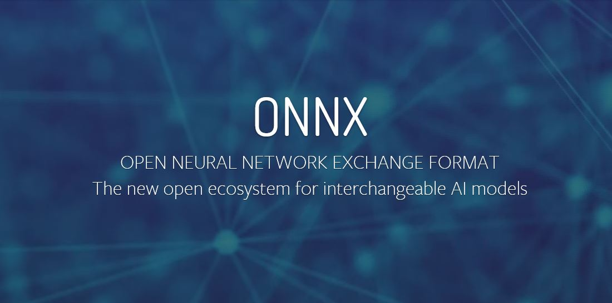

A few weeks ago I wrote a blog post on how accessible ML has become. Before continuing with the announced part 2
of my ML series with a practical REST API example, let's dive further into the accessibility and standartization 
aspects with my latest discovery:
ONNX.

## Neural Networks
While there are a multitude of machine learning algorithms and models, neural networks have been among the most successful
exponents. Along with a catchy name suggesting a close connection to artificial intelligence,
neural networks really are on the cutting edge of machine learning. Major tech companies are heavily involved 
in neural network technology,
providing the major building block for __deep learning__. Hardware vendors are on the bandwagon as well, since AI consumes
a lot of clock cycles, providing hardware-level support for neural networks.

Access for developers is as easy as never before, with neural networks as a service facilitating deployment on all major
clouds. However these facilities have promoted vendor lock-in so far. That is one of the reasons to be thrilled about
ONNX:

## What is ONNX 
__Open Neural Network Exchance__ (ONNX) is a formalized, open exchange format for neural networks, enabling interoperability
between different frameworks. With ONNX, AI developers can more easily move models between state-of-the-art tools.
ONNX had its first stable release in December 2017.

On a technical level, ONNX provides converter functions between different formats and hooks to integrate its own schema
(__ONNX ML__) to major neural network frameworks, as well as bindings for several programming languages.

## What is happening here?
Again, let's compare ML models to libraries. You might remember my last blog post, where I stated that we _can_ integrate ML
models to apps, allowing for dissemination of research and for very practical business purposes. Trained models are somehow
like tested software libraries/modules: They work really well for you if you have the platform to run them, and if you use them according to specs.
ONNX takes care of the first part of this analogy, and to a small degree of the second.
> We need to be able to port __trained__ models between platforms

In comparison to a library however, with neural networks you cannot port functionality from one platform to another by hand, 
e.g. by formal/pseudocode notation of algorithm. You could do that with the untrained base model, but as soon
as it has been trained, there is no way (for a human) to capture the organically grown logic into a formal structure. 
But that is exactly what ONNX does.

## Links
[ONNX on GitHub](https://github.com/onnx/onnx)