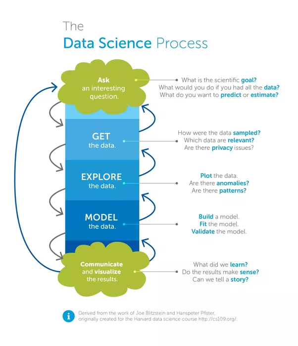

Not long ago Machine Learning used to be pretty "academic" in the sense that the only way to access
it was through formal mathematical notation. Machine Learning is the heartpiece of the still new
profession of __data scientist__, dubbed the _sexiest job of the 21st century_. So far, this sexiness has
become pretty accessible.

This article assumes that you have a rough idea what data science and machine learning are, 
and that you have heard about __R__ and __Python__ with Scikit-Learn being popular languages for data science. 
If you are thinking about robots and artificial intelligence from the movies right now,
you might want to read up on the data science process. It's really more statistics than science fiction magic.

Well, let's explore how statistics has become so accessible (and more fun):

## Jupyter Notebooks
The medium __Jupyter Notebook__ is a breakthrough in documentation of data science (and potentially
for a lot of work on a computer). Jupyter notebooks (formerly iPython notebooks) are 
__interactive documents__ where you can easily intermix text and commands with the output of the commands.
Such a notebook runs in your browser and can be saved as an `.ipybn` file. 

This allows you to document complex workflows in a linear and repeatable fashion, an important step
towards reproducibility of scientific work. Since the notebook is backed by an interpreter kernel,
any step is repeatable and you can inspect any intermediary state, somehow like stepping through a debugger.

The kernel is interchangeable, so you are in no way limited to Python. There exist Jupyter kernels for
dozens of languages, they just have to provide an interpreter.

Graphical output, which is paramount for inspecting data, is rendered directly into the notebook. 
Notebooks can be viewed on Github without rebuilding the runtime locally.

These properties of Jupyter notebooks allow for a data analysis to evolve over time from a simple lab
notebook where data is loaded and explored, then to a model, and ultimately to a fully documented analysis
close to publishing quality.

And then, work can be easily shared with others. You just pass them the notebook file, allowing them
to step through your thinking process and exactly reproduce your model/analysis. As a bonus, those 
files can be viewed on GitHub without any further infrastructure (though they are not interactive there).
This 

## Kaggle Datasets and Challenges
While Jupyter notebooks answer the HOW of accesible data science, Kaggle has great contributions to 
the WHY and WHAT.
* Repeatable, same format
* Competitive environement / Marketplace for data analysis
* Catalysator for best practices
* Convergence, general data science workflows
  * data gathering
  * data cleansing
  * train
  * test
  * predict
* uniform interfaces for algorithms / libraries

## Consequences
* Many kernels publicly available
  * n Kaggle kernels,
  * n github notebooks
* ML models behave more and more like software libraries
  * Devs need to be aware how their interfaces work
* Devs need to integrate ML models to apps; dissemination
  -> next article will be about serving a simple ML model as a rest api.

## Consequences
* ML Models really have become accessible
* Can/should be used as libraries

## Links
.. economy jupyter notebooks